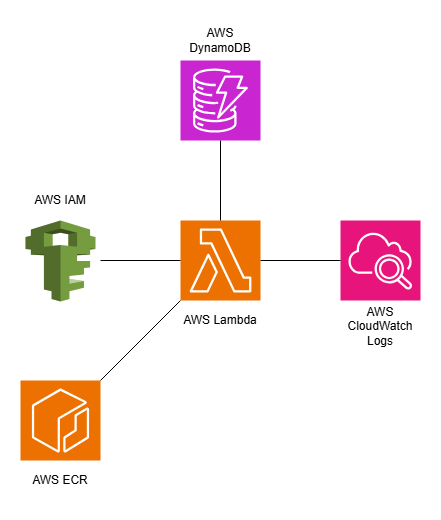

# Terraform-Module-Lambda-DynamoDB

## Table of Contents
- [Terraform-Module-Lambda-DynamoDB](#terraform-module-lambda-dynamodb)
  - [Table of Contents](#table-of-contents)
  - [Overview](#overview)
  - [Usage Guide](#usage-guide)
  - [What the System Looks Like:](#what-the-system-looks-like)

## Overview 
This module creates a lambda, dynamodb, iam policies, log group and ECR registry that have all the proper permissions. I created this module 
to help me with a project that requires I generate lambdas and dynamodbs for various sportsbooks to query odds data. This module allows me to 
easily input variables to customize the module to whatever sportsbooks/sport I'm querying for. While this module is somewhat specific to my 
use case, it is possible to use this module for any project where you need a configured lambda/dynamodb connection. 

## Usage Guide
``` 
module draftkings_basketball_team_api {
    source = "github.com/meagle21/Terraform-Module-Lambda-DynamoDB-Odds-Comparison"
    lambda_function_name = "draftkings_scraping_lambda_nba_team"
    sportsbook_website_url = "https://sportsbook.draftkings.com/leagues/basketball/nba"
    dynambodb_table_name = "draftkings-basketball-team-odds"
    sportsbook = "DraftKings"
    sport = "Basketball"
    team_odds_bool = false
} 
```

## What the System Looks Like:
